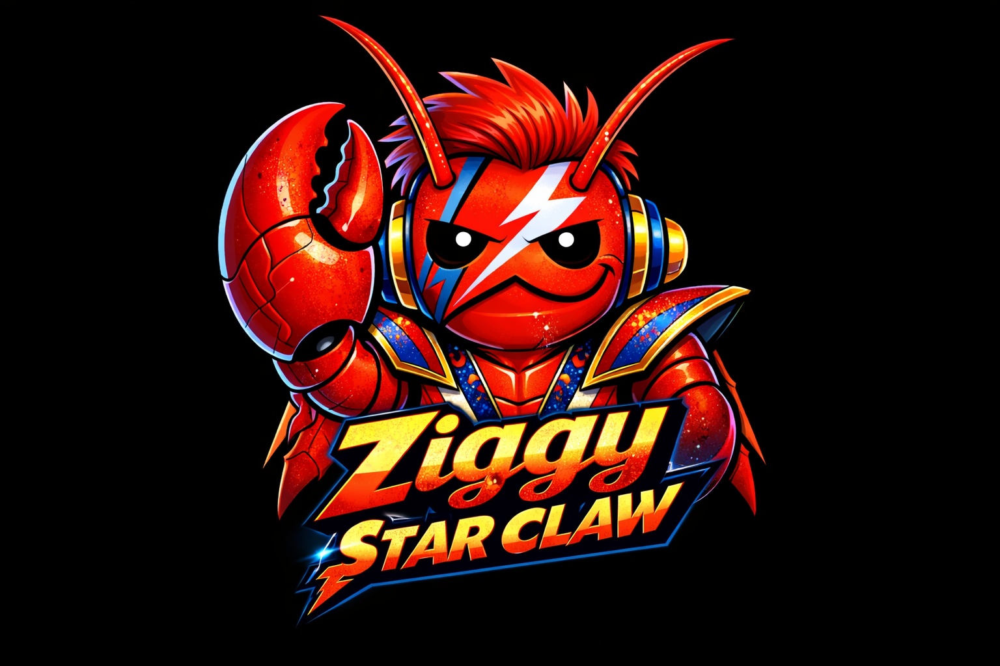

# Ziggy StarClaw and the Lobsters From Mars



Ziggy StarClaw and the Lobsters From Mars AKA ZiggyStartClaw is a implementation of  operator client.

Built with Zig (hence Ziggy) using Imgui UI, its runs on Linux, Windows, Android and WASM (web) and talks via OpenClaw websocket interface. 

Designed  to be used over tailscale VPS (not tested outside that). 

The aim is to provide a small alternative to the offical companion apps (hence Lobsters From Mars, they are aliens!), at the moment its just chat but hoping to provide other services including node usage.


## Status
Active development (latest release: v0.1.18).

Highlights:
- Cross-platform client (Linux, Windows, Android, WASM).
- CLI approvals management and interactive REPL mode (`--interactive`).
- `--run` supports default node from config when `--node` is not provided.
- Auto-connect on launch toggle in Settings.

## User Guide
Start here: `docs/user/README.md`

## Quick Start

```bash
# Fetch dependencies
zig build --fetch

# Build native target
zig build

# Run
zig build run
```

## WASM (Emscripten via zemscripten)

```bash
# Install emsdk once (if not already installed)
./.tools/emsdk/emsdk install latest
./.tools/emsdk/emsdk activate latest

# Build (Windows: run scripts/patch-zemscripten.ps1 once after fetch)\nzig build -Dwasm=true
```

Outputs are installed under `zig-out/web/`.

## Packaging
See `docs/PACKAGING.md` and `docs/RELEASE_CHECKLIST.md` for release packaging and checklist steps.

## Layout
See `docs/ZIGGYSTARCLAW_IMPLEMENTATION_PLAN.md` for the full design and roadmap.
