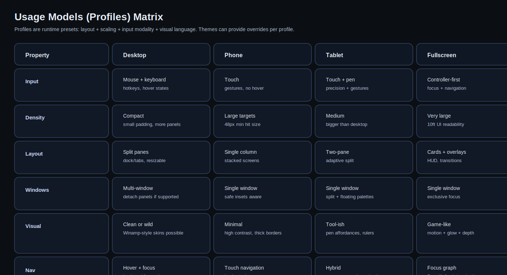
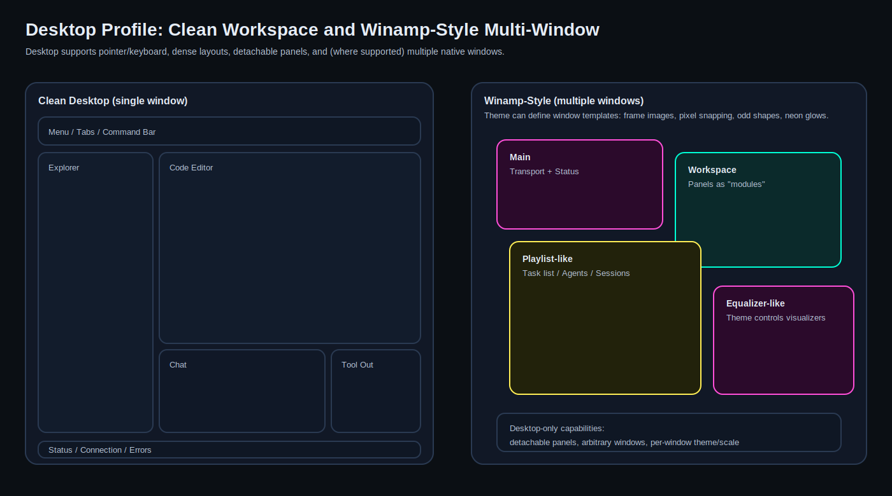
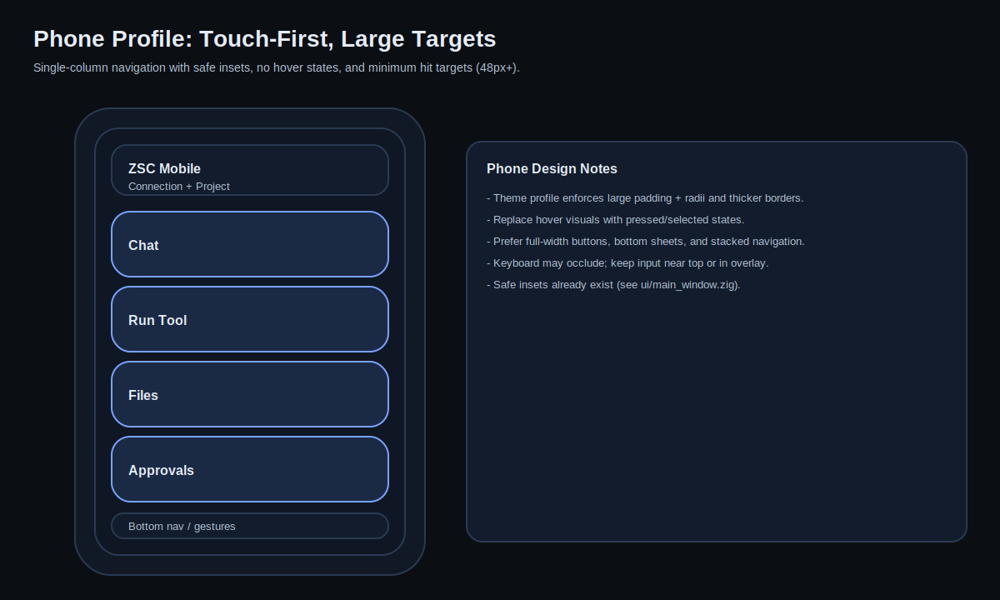

# Usage Models (Profiles)

A **profile** is a runtime preset that answers:
- what input modalities are primary (pointer/touch/pen/controller)
- what layout density and hit-target sizing should be
- whether multi-window is allowed
- what style overrides should apply

Themes can provide **profile-specific overrides** while keeping shared tokens.

## 1. Desktop Profile

### Primary characteristics
- Pointer + keyboard is the default.
- Hover states exist and are meaningful.
- Compact density: multiple panels, tabs, lists.
- Multi-window is allowed where supported.

### Theme expectations
- “Clean modern” can lean on subtle depth: soft shadows, low-noise surfaces.
- “Winamp style” can be bitmap-heavy: neon glows, pixel snapping, textured frames.

### Multi-window support
Desktop themes may define:
- multiple top-level windows (“main”, “inspector”, “playlist-like”, etc)
- detachable panels (a panel can be hosted in a new native window)

This must be **capability-gated** per platform.

## 2. Phone Profile

### Primary characteristics
- Touch-first: no hover.
- Large hit targets (recommendation: 48px min, larger for critical actions).
- Single-column navigation and stacked screens.
- Strong safe inset handling (notches, home indicator). This already exists via `ui.setSafeInsets(...)`.

### Theme expectations
- High contrast, thick borders, strong pressed/selected states.
- Avoid small text and dense tables.

## 3. Tablet Profile

### Primary characteristics
- Hybrid: touch + pen (and sometimes keyboard).
- Adaptive split layouts: 2-pane at landscape, single pane at portrait.
- Floating palettes/toolbars are acceptable.

### Theme expectations
- Slightly larger targets than desktop.
- Visual affordances for precision: clear selection outlines, crisp rulers/grids in canvas views.

## 4. Fullscreen Profile

### Primary characteristics
- Controller-first navigation.
- Always-visible focus system.
- Readability at distance (10ft UI): large typography and strong contrast.
- Uses transitions, overlays, and card-based navigation.

### Theme expectations
- Focus ring + glow as first-class style tokens.
- Motion curves and durations are part of the theme.
- Optional post-processing (bloom, vignette, film grain) if GPU budget allows.

