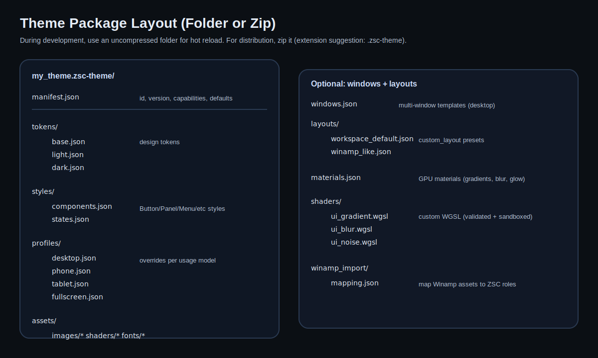

# Theme Package Format



## Goals

- Easy to create/edit by hand.
- Diff-friendly (JSON).
- Supports per-profile overrides.
- Supports GPU materials without exposing arbitrary code execution.

## Packaging

Support two forms:

1. **Development folder**
   - A normal directory on disk.
   - Best for iteration and hot reload.

2. **Distribution archive** (optional)
   - Zip containing the same folder structure.
   - Suggested extension: `.zsc-theme`.

## Files

Required:
- `manifest.json`
- `tokens/base.json`
- `styles/components.json`

Optional:
- `tokens/light.json`, `tokens/dark.json` (or other variants)
- `profiles/*.json` (desktop/phone/tablet/fullscreen overrides)
- `materials.json` + `assets/shaders/*.wgsl`
- `layouts/*.json`
- `windows.json` (desktop multi-window templates)
- `assets/images/*` (png/jpg/etc)

## `manifest.json`

Example:

```json
{
  "schema_version": 1,
  "id": "zsc.clean",
  "name": "Clean Modern",
  "author": "ZiggyStarClaw",
  "license": "MIT",

  "defaults": {
    "variant": "dark",
    "lock_variant": false,
    "profile": "desktop",
    "image_sampling": "linear",
    "pixel_snap_textured": false
  },

  "capabilities": {
    "requires_multi_window": false,
    "requires_custom_shaders": false
  }
}
```

Notes:
- `schema_version` must be bumped when breaking changes occur.
- `capabilities` enables early rejection/fallback.
- `defaults.lock_variant` can be set to `true` for themes that should not allow user light/dark switching
  (for example: textured chrome packs that are authored for only one variant).

## Packaging (Directory vs Zip)

Theme packs can be loaded from either:
- a directory path (containing `manifest.json`, `tokens/`, `styles/`, optional `assets/`, optional `windows.json`)
- a `.zip` file path

For `.zip` packs, ZiggyStarClaw extracts the archive into a sibling cache directory and then loads it as a normal directory pack.

Zip layout rules:
- Preferred: `manifest.json` at the archive root.
- Also accepted: a single top-level directory containing `manifest.json`.

## Token Files

The existing repo token model is a good base (colors/typography/spacing/radius/shadows).

Example `tokens/base.json` (shape mirrors `src/ui/theme/theme.zig`):

```json
{
  "colors": {
    "background": [0.08, 0.09, 0.10, 1.0],
    "surface": [0.12, 0.14, 0.17, 1.0],
    "primary": [0.90, 0.58, 0.23, 1.0],
    "success": [0.20, 0.66, 0.33, 1.0],
    "danger": [0.92, 0.26, 0.20, 1.0],
    "warning": [0.98, 0.73, 0.02, 1.0],
    "text_primary": [0.90, 0.92, 0.94, 1.0],
    "text_secondary": [0.60, 0.64, 0.68, 1.0],
    "border": [0.17, 0.19, 0.23, 1.0],
    "divider": [0.13, 0.15, 0.18, 1.0]
  },
  "typography": {
    "font_family": "Space Grotesk",
    "title_size": 22.0,
    "heading_size": 18.0,
    "body_size": 16.0,
    "caption_size": 12.0
  },
  "spacing": { "xs": 4.0, "sm": 8.0, "md": 16.0, "lg": 24.0, "xl": 32.0 },
  "radius": { "sm": 4.0, "md": 8.0, "lg": 12.0, "full": 9999.0 },
  "shadows": {
    "sm": { "blur": 2.0, "spread": 0.0, "offset_x": 0.0, "offset_y": 1.0 },
    "md": { "blur": 4.0, "spread": 0.0, "offset_x": 0.0, "offset_y": 2.0 },
    "lg": { "blur": 8.0, "spread": 0.0, "offset_x": 0.0, "offset_y": 4.0 }
  }
}
```

## Style Sheet (`styles/components.json`)

The style sheet should prevent widgets from doing ad-hoc token math everywhere.

### Implemented Component Keys

The following keys are currently implemented in ZiggyStarClaw (as of the `feature/theme_engine` branch):

- `surfaces`: `background`, `surface`
- `button.primary|secondary|ghost`: `radius`, `fill`, `text`, `border`
- `checkbox`: `radius`, `fill`, `border`, `fill_checked`, `border_checked`, `check`
- `text_input`: `radius`, `fill`, `border`, `text`, `placeholder`, `selection`, `caret`
- `panel`: `radius`, `fill`, `border`, `shadow`, `frame`
- `focus_ring`: `thickness`, `color`, `glow`

Notes:
- Any missing field falls back to the theme tokens (or existing widget defaults).
- Unknown fields are ignored (so packs can be forward-compatible).

`panel.overlay` (implemented):
- Optional paint drawn over the entire panel rect after fill+frame (useful for lighting layers that should affect edges too).

`surfaces` is used by views/panels when they need to paint large rectangular backgrounds:
- `surfaces.background`: replaces common `colors.background` fills
- `surfaces.surface`: replaces common `colors.surface` fills

Example (sketch):

```json
{
  "surfaces": {
    "background": { "image": { "path": "assets/images/bg_tile.png", "mode": "tile" } },
    "surface": { "image": { "path": "assets/images/surface_tile.png", "mode": "tile" } }
  },
  "button": {
    "primary": {
      "radius": "radius.md",
      "padding": [16, 10],
      "fill": "colors.primary",
      "text": "#FFFFFFFF",
      "material": "mat.button_glow"
    },
    "secondary": {
      "radius": "radius.sm",
      "padding": [12, 8],
      "fill": "colors.surface",
      "text": "colors.text_primary"
    }
  },
  "focus_ring": {
    "thickness": 3.0,
    "color": "#6BE4B2FF",
    "glow_material": "mat.focus_glow"
  },
  "panel": {
    "fill": "colors.surface",
    "content_inset_px": [8, 8, 8, 8],
    "header_overlay": { "image": { "path": "assets/images/surface_tile.png", "mode": "tile", "tint": "#FFFFFFB0" } },
    "focus_border": "colors.primary",
    "shadow": {
      "color": "#00000066",
      "blur_px": 18.0,
      "spread_px": 2.0,
      "falloff_exp": 1.35,
      "offset": [0.0, 8.0],
      "steps": 12
    },
    "frame": {
      "image": "assets/images/panel_frame.png",
      "slices_px": [8, 8, 8, 8],
      "tint": "#FFFFFFCC",
      "draw_center": true,
      "center_mode": "stretch",
      "center_anchor": "start"
    }
  }
}
```

Pragmatic recommendation:
- allow both direct values and “token references” like `colors.primary`.

`panel.frame` fields (implemented):
- `image`: string (asset path, relative to pack root)
- `slices_px`: `[left, top, right, bottom]` (source pixels)
- `tint`: color (optional)
- `draw_center`: bool (default true)
- `center_overlay`: paint (optional, drawn into the 9-slice interior after the frame; useful for lighting/highlight layers)
- `center_mode`: `"stretch"`, `"tile"`, `"tile_x"`, `"tile_y"` (default `"stretch"`)
- `center_anchor`: `"start"` or `"end"` (default `"start"`, only applies to `center_mode: "tile"`/`"tile_x"`/`"tile_y"`)

Additional `panel` fields (implemented):
- `content_inset_px`: `[left, top, right, bottom]` pixels. Used by layouts to keep content out of thick frame borders.
- `header_overlay`: paint. Used by the docked panel host header strip (so textured themes don't get a flat solid header).
- `focus_border`: color. Used by the docked panel host focus border (fallback: `colors.primary`).

`menu.item` fields (implemented):
- `radius`: number or token (optional)
- `fill`: paint (optional)
- `text`: color (optional)
- `border`: color (optional)
- `states`: optional per-state overrides:
  - `hover`, `pressed`, `focused`, `disabled`, `selected`, `selected_hover`

Notes:
- The menu's check indicator uses the `checkbox` style (`checkbox.fill`, `checkbox.fill_checked`, `checkbox.border`, `checkbox.border_checked`, `checkbox.check`).

`tabs` fields (implemented):
- `radius`: number or token (optional)
- `fill`: paint (optional, inactive tabs)
- `text`: color (optional, inactive tabs)
- `border`: color (optional)
- `underline`: color (optional)
- `underline_thickness`: number (optional)
- `states`: optional per-state overrides:
  - `hover`, `pressed`, `focused`, `disabled`, `active`, `active_hover`

### Paint Values (Implemented)

Where a component field expects a `fill`, ZiggyStarClaw currently supports:

1. Solid color (back-compat):

```json
{ "fill": "colors.surface" }
```

2. 4-corner gradient (bilinear, GPU vertex colors):

```json
{
  "fill": {
    "gradient4": {
      "tl": "colors.surface",
      "tr": "colors.background",
      "bl": "colors.background",
      "br": "colors.surface"
    }
  }
}
```

3. Image paint (stretch or tile):

```json
{
  "fill": {
    "image": {
      "path": "assets/images/brushed_metal_tile.png",
      "mode": "tile",
      "scale": 1.0,
      "tint": "#FFFFFFFF",
      "offset_px": [0, 0]
    }
  }
}
```

Notes:
- `mode`: `"stretch"` (default) or `"tile"`.
- `scale`: optional. For `"tile"`, higher values produce fewer/larger tiles.
- `tint`: optional multiply tint.
- `offset_px`: optional tiling origin offset.

### Effect Values (Implemented)

`panel.shadow` and `focus_ring.glow` share the same effect object fields:

- `color`: RGBA array, hex string, or `colors.*` token (required to enable the effect)
- `blur_px`: number
- `spread_px`: number
- `offset`: `[x, y]`
- `steps`: integer (currently unused; reserved for multi-pass approximations)
- `falloff_exp`: number (1.0 default, >1 tighter edge, <1 softer spread)
- `ignore_clip`: boolean (if true, draws ignoring the clip stack)
- `blend`: `"alpha"` (default) or `"additive"`

## Profile Overrides (`profiles/*.json`)

Example `profiles/phone.json`:

```json
{
  "profile": "phone",
  "overrides": {
    "typography": { "body_size": 18.0 },
    "spacing": { "sm": 12.0, "md": 20.0 },
    "components": {
      "button": { "hit_target_min_px": 52.0 }
    }
  }
}
```

## Asset Paths and Platform Resolution

The theme engine should use a single abstraction for reading assets:

- Native desktop: `std.fs` read from theme directories.
- Android: read from APK assets (or app-private storage) and/or external storage (capability-gated).
- WASM: fetch over HTTP (and optionally cache in IndexedDB); local filesystem is not portable.

The docs assume “file loading can be added on most platforms”, but the loader must still be capability-gated.

## `windows.json` (Multi-Window Templates)

Theme packs can optionally include `windows.json` to define desktop window templates (Winamp-style multiple windows, detachable layouts, etc.).

Schema (see `src/ui/theme_engine/schema.zig`):

```json
{
  "schema_version": 1,
  "windows": [
    {
      "id": "workspace",
      "title": "Workspace",
      "width": 960,
      "height": 720,
      "profile": "desktop",
      "variant": "dark",
      "image_sampling": "linear",
      "pixel_snap_textured": false,
      "panels": ["workspace", "chat", "showcase"],
      "focused_panel": "workspace"
    }
  ]
}
```

Notes:
- `profile` is optional; if omitted, the app uses config/auto profile resolution.
- `variant` is optional (`"light"` or `"dark"`). If set, it applies to that window only.
- `image_sampling` and `pixel_snap_textured` let pixel-art packs opt into nearest sampling and pixel snapping.
