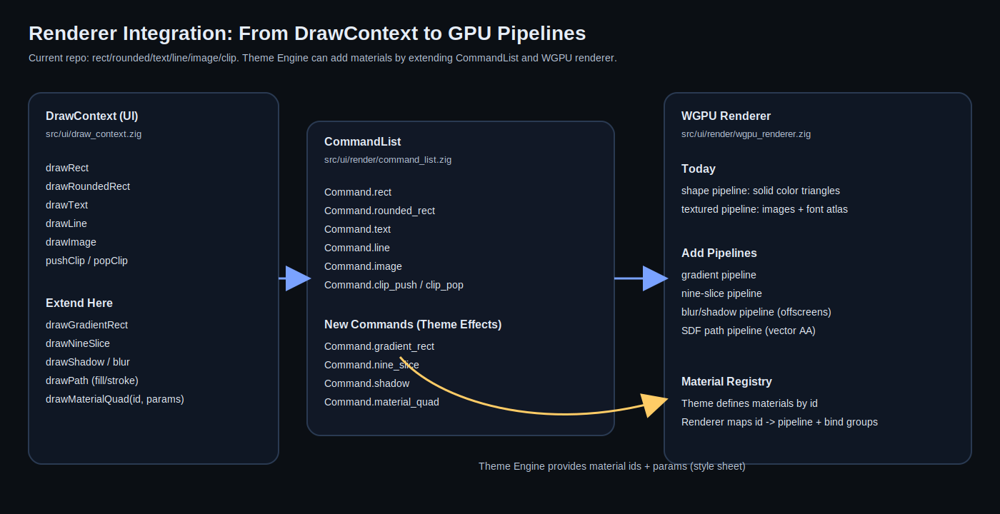

# Rendering and Effects (GPU-Powered Themes)

ZiggyStarClaw already records UI drawing as a command list and renders it via WebGPU.

- UI API: `src/ui/draw_context.zig`
- Command recording: `src/ui/render/command_list.zig`
- Renderer: `src/ui/render/wgpu_renderer.zig`

This is the ideal architecture for a theme engine that wants “full GPU power”.



## Current Command Set (Baseline)

Today, `CommandList` supports:
- filled + stroked rect
- filled + stroked rounded rect
- line
- text (font atlas)
- image (tinted)
- push/pop clip

The current renderer implements:
- `shape` pipeline for solid-color triangles
- `textured` pipeline for images and text glyphs

## What “GPU-Powered Themes” Need

To support the requested theme goals (clean modern + Winamp crazy + game UI), themes must be able to request:

1. **Gradients**
   - linear and radial
   - multi-stop (optional)

2. **Shadows and blur**
   - soft drop shadows
   - inner shadows
   - blurred panels or frosted-glass effects (profile dependent)

3. **9-slice / frame rendering**
   - bitmap frames (Winamp-style)
   - scalable borders without distortion

4. **Vector shapes with anti-aliasing**
   - crisp rounded corners
   - arbitrary paths for stylized UI

5. **Animated materials**
   - subtle noise, scanlines, glow pulses
   - background shaders for fullscreen/game profile

## Recommended Design: “Materials”

Instead of adding one-off commands forever, introduce a material concept:

- A **material** is a shader + parameter layout + render pipeline.
- A widget emits a *material draw* command with:
  - rect
  - material id
  - parameters blob offset

### Example API (Zig sketch)

```zig
pub const MaterialId = u32;

pub const MaterialParams = union(enum) {
    solid: struct { color: [4]f32 },
    gradient_linear: struct { c0: [4]f32, c1: [4]f32, dir: [2]f32 },
    nine_slice: struct { tex: u32, slices: [4]f32, tint: [4]f32 },
    shadow: struct { color: [4]f32, blur: f32, offset: [2]f32 },
};

pub fn drawMaterialRect(dc: *DrawContext, rect: Rect, id: MaterialId, params: MaterialParams) void;
```

### Why this works well here
- `DrawContext` already records to a list.
- `wgpu_renderer.zig` already batches by pipeline and bind group.
- Adding new pipelines is centralized and testable.

## Minimal Extensions (If You Want Smaller Steps)

If “materials” feels too big initially, implement in slices:

1. Add `drawRectGradient` / `drawRoundedRectGradient` + `Command.rect_gradient` / `Command.rounded_rect_gradient`
2. Add `drawNineSlice` + `Command.nine_slice`
3. Add `drawShadow` + `Command.shadow`
4. Once you have 3-4 effect commands, refactor into materials to avoid combinatorial growth.

### Status In This Branch

- Implemented: **4-corner gradients** (`gradient4`) for filled rects and filled rounded rects.
  - StyleSheet `fill` can be a solid color or `{ "gradient4": { "tl": ..., "tr": ..., "bl": ..., "br": ... } }`.
  - Renderer implementation uses per-vertex colors (bilinear interpolation).
- Implemented: **9-slice frames** (textured)
  - StyleSheet `panel.frame` can reference an image and `slices_px`.
  - Renderer implementation expands into 9 quads with appropriate UVs.
- Implemented: **Soft shadows and glows** (approximation)
  - StyleSheet `panel.shadow` and `focus_ring.glow`.
  - Current implementation uses a dedicated **SDF rounded-rect shader** (single draw per shadow/glow).
  - This keeps the API portable across native/wasm/android while staying “GPU powered”.
  - Extra tuning knobs:
    - `falloff_exp`: exponent applied to the computed alpha (1.0 default, >1 tighter, <1 softer).
    - `blend`: `"alpha"` (default) or `"additive"` (useful for glows that should pop over bright backgrounds).
    - `ignore_clip`: if true, draws with a full-screen scissor instead of the current clip stack (useful for drop shadows).
      - Warning: setting this on a broad style like `panel.shadow` can cause shadows to bleed outside scroll/clipped regions.

## Performance Notes

- Prefer GPU solutions that keep batching stable.
- Avoid per-widget offscreen passes on desktop density UIs.
- Use caching aggressively:
  - blur: cache blurred textures by (source, blur radius, scale)
  - nine-slice: keep slicing in shader if possible
  - text: already uses atlases

## Theme Engine Connection

The theme engine should not “draw”. It should:
- define material ids
- define default params for component states
- provide shader sources (WGSL) and asset references

The UI code uses the style sheet to pick:
- which material id to use for each component/state
- which parameters to pass
