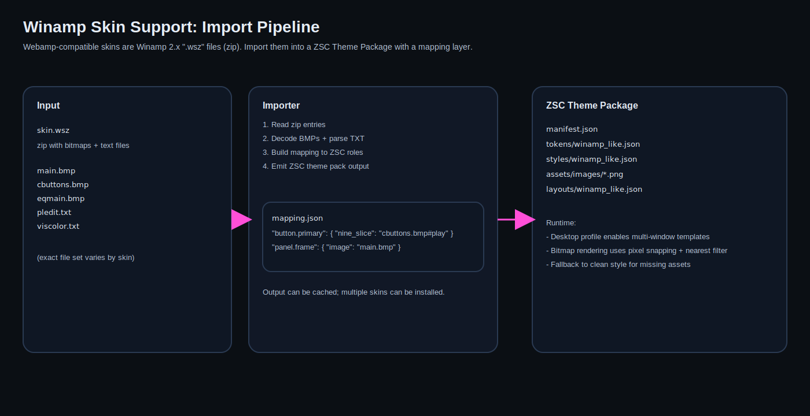

# Winamp-Style Skins (Webamp-Compatible)

Goal: support a desktop theme mode that can be either:
- **Clean modern** (vector UI + subtle effects)
- **Winamp-style crazy** (bitmap skins, neon frames, multiple windows)

This doc focuses on the Winamp side.



## What “Webamp Skins” Are

Webamp’s skin ecosystem is built around classic Winamp 2.x skins.

Key points (external references):
- Webamp is compatible with classic Winamp skins (`.wsz` files) and supports separate windows (main/playlist/equalizer).
  - Reference: https://webamp.org/
- Webamp documentation describes skins and how they are loaded.
  - Reference: https://docs.webamp.org/
- Winamp 2.x skins are zip archives containing a known set of BMP assets and some TXT files.
  - Quick file overview reference: https://archive.d2k5.com/tutorials/winamp_skinning/

## Integration Strategy (Recommended)

### Tier 0: Winamp-inspired theme (fast)
- Use the existing vector UI.
- Provide a theme pack with:
  - neon colors
  - hard borders
  - glow focus ring
  - scanline/noise background material
- No bitmap import.

This gets “Winamp energy” quickly without huge technical risk.

### Tier 1: Bitmap skin kit (targeted)
Add a bitmap-based styling system that can skin core components:
- window frame/title bar
- buttons
- sliders
- list background

Key renderer additions:
- nine-slice
- pixel snapping (optional per window)
- nearest-neighbor sampling option per material

### Tier 2: Winamp 2.x importer (.wsz) (Not planned right now)
We are *not* implementing a `.wsz` importer in the near term.

Reason:
- It is a large amount of format-specific work (zip/BMP/TXT parsing + mapping) for relatively low product value,
  compared to just shipping “Winamp-style” packs authored directly as ZSC theme packs.

If we ever revisit this, prefer keeping it as an **offline converter tool** (not a runtime dependency).

### Tier 3: Arbitrary window shapes (optional)
Some Winamp skins use non-rectangular windows.

This is heavily platform-dependent:
- Windows: region APIs exist
- X11: shape extension may work
- Wayland: generally not supported for arbitrary window shapes
- macOS: possible but platform-specific
- WASM/mobile: not realistic

Recommendation:
- treat shaped windows as “best effort” with clean fallback to rectangular.

## Theme Package Hooks for Winamp Mode

Add optional sections:

- `windows.json`: defines multiple windows and their default sizes/roles.
- (Optional, future) `winamp_import/mapping.json`: mapping from imported resources to ZSC style roles.

Example mapping concept:

```json
{
  "roles": {
    "window.main.frame": "assets/images/main_frame.png",
    "button.primary": {
      "nine_slice": {
        "image": "assets/images/cbuttons.png",
        "slice": [6, 6, 6, 6]
      }
    }
  }
}
```

## Practical Limitations (Be Explicit)

- ZSC is a workspace app, not a music player.
  - The goal is not to recreate Winamp 1:1, but to allow that aesthetic and window behavior.
- Some skins will not have assets that map cleanly to ZSC components.
  - Use fallback styles.
- Real Winamp support implies multiple windows.
  - Capability-gate it.
