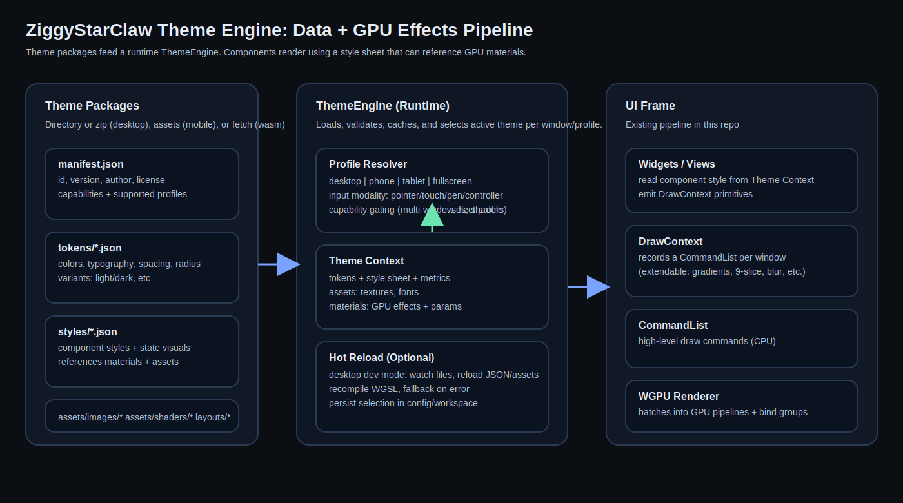

# Theme Engine (Design + Implementation Notes)

This folder documents a practical path to a **full theme engine** for ZiggyStarClaw.

ZiggyStarClaw already has a custom immediate-mode UI with a GPU-backed renderer on all platforms:
- UI draw API: `src/ui/draw_context.zig`
- Recorded command stream: `src/ui/render/command_list.zig`
- WebGPU renderer: `src/ui/render/wgpu_renderer.zig`
- Existing design tokens (light/dark): `src/ui/theme/*` + `src/ui/theme.zig`

The goal of this theme engine is to move beyond “light/dark” tokens and support:
- Multiple **usage models** (Desktop, Phone, Tablet, Fullscreen)
- Runtime **theme packages** (assets, styles, layouts)
- GPU-driven **materials/effects** (gradients, glows, blur, stylized frames)
- Desktop **multi-window** and “Winamp-style” skin craziness where supported

## Start Here

1. Usage models overview: `docs/theme_engine/02_usage_models.md`
2. Core architecture and integration points: `docs/theme_engine/03_architecture.md`
3. Theme package format (directory/zip): `docs/theme_engine/04_theme_package_format.md`
4. GPU materials and DrawContext extensions: `docs/theme_engine/05_rendering_and_effects.md`
5. Multi-window and layout strategy: `docs/theme_engine/06_multi_window_and_layout.md`
6. Input modalities + controller navigation: `docs/theme_engine/07_input_and_navigation.md`
7. Winamp skin import approach: `docs/theme_engine/08_winamp_skin_support.md`
8. Implementation plan (phases): `docs/theme_engine/09_implementation_plan.md`
9. Codex CLI workflow checklists: `docs/theme_engine/10_codex_cli_workflow.md`

## Examples

A minimal example theme pack (tokens + styles) lives at:
- `docs/theme_engine/examples/zsc_clean/manifest.json`

## Key Concepts (Terms)

- **Theme Tokens**: raw values like colors, spacing, typography, radius, motion.
- **Style Sheet**: per-component styles (Button/Panel/Menu/FocusRing/etc) derived from tokens.
- **Materials**: GPU effect definitions (shaders + parameters) used by styles.
- **Profile**: usage-model preset (desktop/phone/tablet/fullscreen) that picks layout density, input modality, and style overrides.
- **Theme Package**: a distributable bundle that provides tokens, styles, materials, assets, and optional layouts/windows.

## Why This Fits The Repo

ZiggyStarClaw’s render path is already structured as:

UI code -> DrawContext -> CommandList -> WGPU renderer -> GPU

So the theme engine should:
- provide **data** (tokens/styles/material ids)
- and rely on **DrawContext + renderer** for actual drawing and batching.
